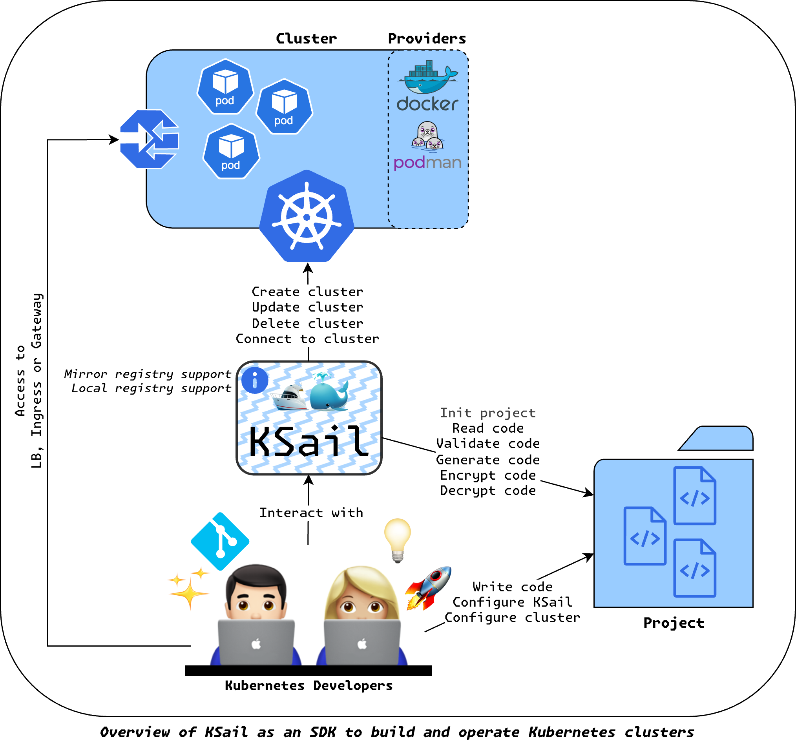

# Overview

KSail is an SDK for Kubernetes allowing you to easily create, manage, and dismantle Kubernetes clusters in various container engines. It is built on top of popular Kubernetes tools with the goal of improving the developer experience (DX) when working with Kubernetes.

## Target Audience

KSail is designed for Platform Engineers, DevOps Engineers, and Developers who work with Kubernetes, but it is also suitable for anyone interested in learning about Kubernetes and prefers a hands-on approach to learning. It is particularly useful for those who want to simplify the process of creating and managing Kubernetes clusters, as well as those who want to improve their development experience when working with Kubernetes.

## Key Features

- **Initialize projects:** Initialize new kubernetes projects with a single command.
- **Provision and Manage Clusters:** Easily create, manage, and dismantle Kubernetes clusters across supported container engines.
- **Customizable Cluster Components:** Configure essential components like CNI, Ingress, Gateway, and other add-ons to suit your needs.
- **Deployment of manifests:** Deploy manifests to clusters seamlessly using popular deployment tools.
- **Debugging and Troubleshooting:** Connect to and troubleshoot clusters with built-in tools and commands for quick issue resolution.
- **Generate manifests:** Generate Kubernetes manifests for various components and configurations.
- **Secure Secret Management:** Manage secrets securely in Git.
- **Mirror Registry Management:** Set up and manage mirror registries to optimize image pulling and reduce external dependencies.
- **Cluster Validation:** Validate cluster configurations and manifests.
- **Extensible Architecture:** Extend KSail sub-projects with provisioners for custom container engines, distributions, and components.
