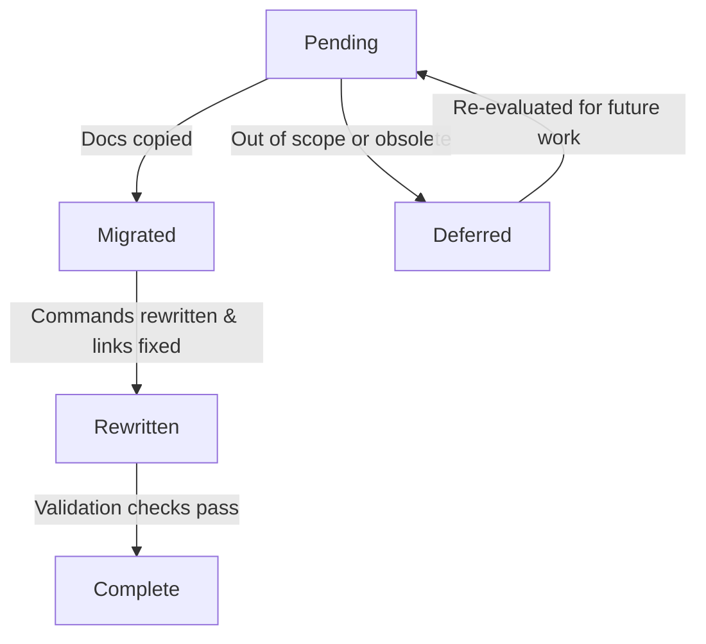

# Data & Documentation Model — 001-migrate-docs

## Entities

### DocumentationSection

- **Purpose**: Represents a Markdown topic or collection to migrate into `ksail-go/docs/`.
- **Key Attributes**:
  - `sourcePath` (string): Relative path under `projects/ksail/docs/`.
  - `targetPath` (string): Destination under `ksail-go/docs/`.
  - `category` (enum): `overview`, `configuration`, `use-case`, `asset-index`.
  - `status` (enum): `pending`, `migrated`, `rewritten`, `deferred`.
  - `requiresCommandUpdate` (bool): Indicates legacy command syntax that must be rewritten.
  - `notes` (string): Rationale for adjustments or deferrals.
- **Relationships**:
  - `assets` (list of DocumentationAsset): Images or diagrams referenced by the section.
  - `dependentSections` (list of DocumentationSection): Other sections linked via navigation.

### DocumentationAsset

- **Purpose**: Tracks images/diagrams stored in `docs/images/` to ensure correct references after migration.
- **Key Attributes**:
  - `fileName` (string): Asset filename.
  - `sourcePath` (string): Original KSail path.
  - `targetPath` (string): Destination within `ksail-go/docs/images/`.
  - `usedBy` (list of DocumentationSection): Sections referencing the asset.
  - `altText` (string): Short description to keep accessibility intact.
- **Relationships**:
  - Belongs to exactly one `DocumentationSection` set (shared assets may link to multiple sections).

### CommandMapping

- **Purpose**: Captures canonical replacements for CLI syntax changes.
- **Key Attributes**:
  - `legacyCommand` (string): Example from KSail docs (e.g., `ksail up`).
  - `goCommand` (string): Replacement syntax (e.g., `ksail cluster create`).
  - `description` (string): Context for when the command should be used.
  - `appliesToSections` (list of DocumentationSection): Docs requiring the updated snippet.
- **Relationships**:
  - Many-to-many with `DocumentationSection` through `appliesToSections`.

### ValidationCheck

- **Purpose**: Defines automated/manual checks ensuring migrated docs meet quality gates.
- **Key Attributes**:
  - `tool` (enum): `markdownlint`, `lychee`, `github-preview`.
  - `command` (string): Exact invocation (e.g., `npx markdownlint-cli2 "docs/**/*.md"`).
  - `scope` (string): Directory or file glob.
  - `frequency` (enum): `pre-commit`, `pre-pr`, `post-merge`.
  - `status` (enum): `planned`, `running`, `passed`, `failed`.
- **Relationships**:
  - Linked to `DocumentationSection` via which sections must pass the check before marking `status = migrated`.

## Derived Views

| View | Description |
|------|-------------|
| `MigrationChecklist` | Tabular summary of each `DocumentationSection` with `status`, assigned owner, command updates applied, outstanding issues. |
| `AssetUsageMatrix` | Map of `DocumentationAsset` vs `DocumentationSection` to confirm no orphaned assets remain. |

## State Transitions

- `Pending` → `Migrated`: Initial file copy performed.
- `Migrated` → `Rewritten`: Content updated for KSail-Go terminology/command structure.
- `Rewritten` → `Complete`: Markdownlint + Lychee + preview checks succeed.
- `Deferred`: Captures sections intentionally skipped; may transition back to `Pending` if requirements change.
