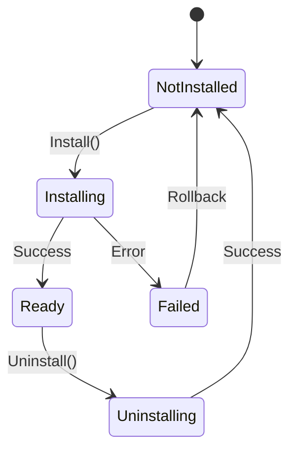
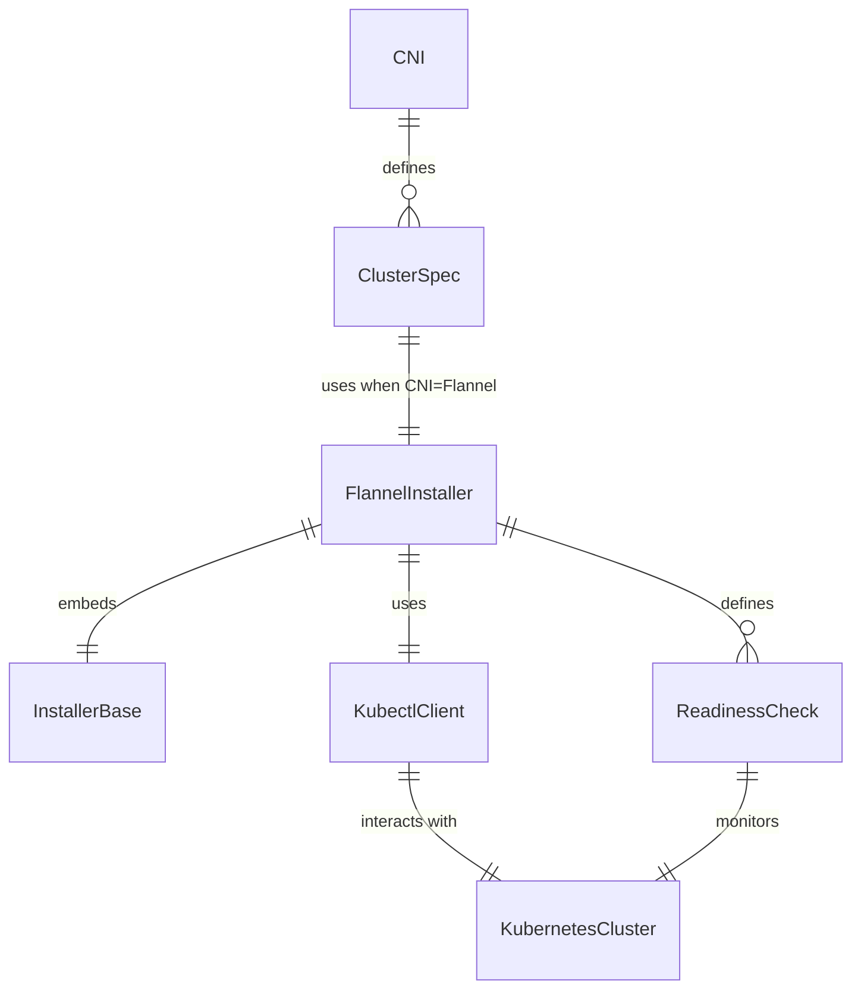
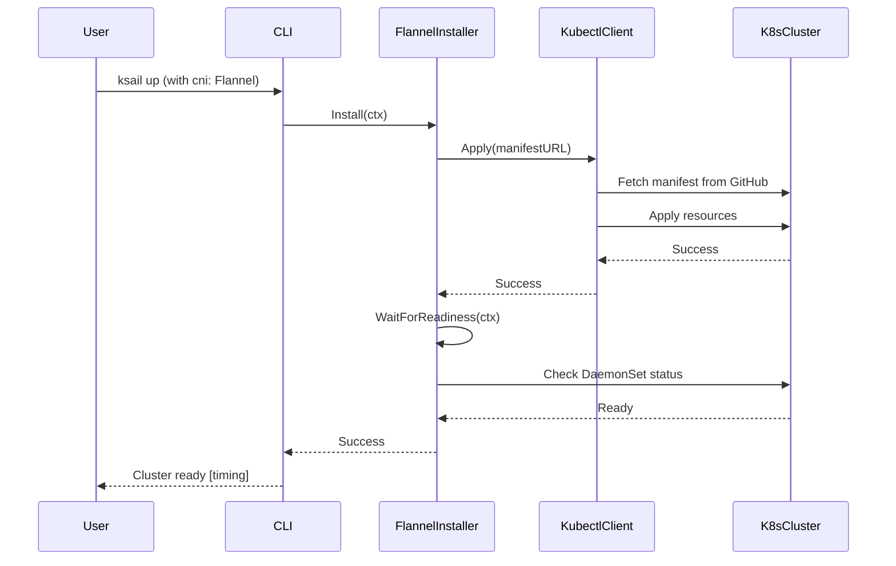
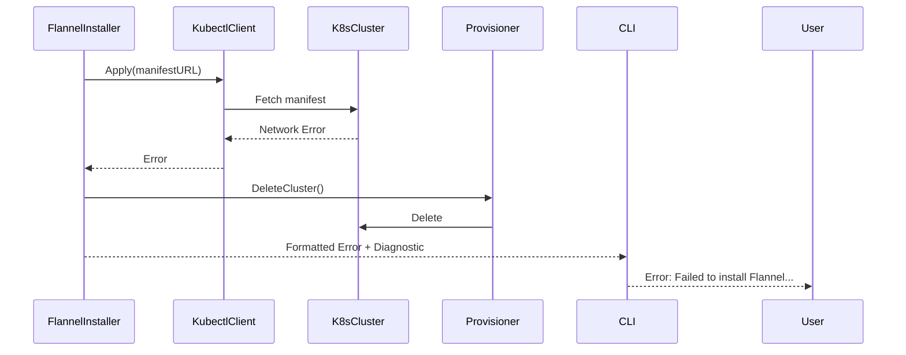

# Data Model: Flannel CNI Implementation

**Phase**: 1 - Design & Contracts
**Date**: 2025-11-15
**Status**: Complete

## Entities

### 1. CNI Type Enum (Modified)

**Location**: `pkg/apis/cluster/v1alpha1/types.go`

**Purpose**: Defines supported CNI options in cluster configurations

**Attributes**:

```go
type CNI string

const (
    CNIDefault CNI = "Default"  // Existing
    CNICilium  CNI = "Cilium"   // Existing
    CNICalico  CNI = "Calico"   // Existing
    CNIFlannel CNI = "Flannel"  // NEW
)
```

**Validation Rules**:

- MUST be one of the defined constants
- Case-sensitive string matching
- Used in ksail.yaml configuration files
- Validated by `CNI.Set()` method

**Relationships**:

- Referenced by `ClusterSpec.CNI` field
- Used in scaffolder to determine distribution CNI settings
- Drives installer factory selection in cluster create command

### 2. Flannel Installer

**Location**: `pkg/svc/installer/cni/flannel/installer.go`

**Purpose**: Installs and manages Flannel CNI lifecycle

**Attributes**:

```go
type FlannelInstaller struct {
    *cni.InstallerBase  // Embedded base installer
    // Inherits:
    // - kubeconfig string
    // - context string
    // - timeout time.Duration
    // - client kubectl.Interface (NEW type)
    // - waitFn func(context.Context) error
}
```

**Methods**:

- `NewFlannelInstaller(client kubectl.Interface, kubeconfig, context string, timeout time.Duration) *FlannelInstaller`
- `Install(ctx context.Context) error` - Applies Flannel manifest and waits for readiness
- `Uninstall(ctx context.Context) error` - Removes Flannel components
- `SetWaitForReadinessFunc(waitFunc func(context.Context) error)` - Override for testing
- `waitForReadiness(ctx context.Context) error` - Private method for readiness checks

**State Transitions**:



**Validation Rules**:

- Manifest URL must be accessible (internet connectivity required)
- Kubernetes cluster must be reachable
- Timeout must be positive duration
- Context must exist in kubeconfig

**Relationships**:

- Implements `installer.Installer` interface
- Embeds `*cni.InstallerBase` for shared functionality
- Uses `kubectl.Interface` for manifest application
- Called by cluster create command when CNI is Flannel

### 3. Kubectl Client Interface (NEW)

**Location**: `pkg/client/kubectl/client.go`

**Purpose**: Abstracts kubectl manifest application operations

**Attributes**:

```go
type Interface interface {
    Apply(ctx context.Context, manifestURL string) error
}

type Client struct {
    kubeconfig string
    context    string
    restConfig *rest.Config
}
```

**Methods**:

- `New(kubeconfig, context string) (Interface, error)` - Factory function
- `Apply(ctx context.Context, manifestURL string) error` - Fetch and apply manifest

**Validation Rules**:

- Manifest URL must be valid HTTP/HTTPS URL
- Manifest must be valid YAML
- Resources must be valid Kubernetes objects
- Cluster must be accessible

**Relationships**:

- Used by `FlannelInstaller`
- Wraps Kubernetes dynamic client for manifest application
- Mockable via `mockery` for testing

### 4. Readiness Check Configuration

**Location**: Defined in `flannel/installer.go`, uses `pkg/k8s.ReadinessCheck`

**Purpose**: Specifies resources to monitor for Flannel readiness

**Attributes**:

```go
// Uses existing k8s.ReadinessCheck struct:
type ReadinessCheck struct {
    Type      string // "daemonset"
    Namespace string // "kube-flannel"
    Name      string // "kube-flannel-ds"
}
```

**Configuration**:

```go
checks := []k8s.ReadinessCheck{
    {
        Type:      "daemonset",
        Namespace: "kube-flannel",
        Name:      "kube-flannel-ds",
    },
}
```

**Validation Rules**:

- DaemonSet must have desired number of pods ready
- All nodes must have Flannel pod running
- Timeout enforced (default from cluster config)

**Relationships**:

- Used by `FlannelInstaller.waitForReadiness()`
- Processed by `installer.WaitForResourceReadiness()`
- Monitored resources exist in Kubernetes cluster

## Entity Relationships



## Data Flow

### Installation Flow



### Error Handling Flow



## Configuration Schema

### ksail.yaml Changes

```yaml
apiVersion: ksail.dev/v1alpha1
kind: Cluster
spec:
  cni: Flannel  # NEW valid value (was: Default, Cilium, Calico)
  # ... other fields unchanged
```

### Generated Distribution Configs

**Kind configuration (kind.yaml)**:

```yaml
kind: Cluster
apiVersion: kind.x-k8s.io/v1alpha4
networking:
  disableDefaultCNI: true  # Required when cni: Flannel
  # ... other settings
```

**K3d configuration (k3d.yaml)**:

```yaml
# CLI args in k3d cluster create command:
# --flannel-backend=none  # Required when cni: Flannel
```

## Validation Schema Updates

**Location**: `pkg/apis/cluster/v1alpha1/types.go`

```go
// validCNIs returns all valid CNI values
func validCNIs() []CNI {
    return []CNI{CNIDefault, CNICilium, CNICalico, CNIFlannel}  // Add CNIFlannel
}

// Set validates and sets the CNI value
func (c *CNI) Set(value string) error {
    switch CNI(value) {
    case CNIDefault, CNICilium, CNICalico, CNIFlannel:  // Add CNIFlannel case
        *c = CNI(value)
        return nil
    default:
        return fmt.Errorf("%w: %s (valid: %s, %s, %s, %s)",
            ErrInvalidCNI, value, CNIDefault, CNICilium, CNICalico, CNIFlannel)
    }
}
```

## Constants

### Manifest URL

```go
const (
    flannelManifestURL = "https://github.com/flannel-io/flannel/releases/latest/download/kube-flannel.yml"
)
```

### Namespace and Resource Names

```go
const (
    flannelNamespace     = "kube-flannel"
    flannelDaemonSetName = "kube-flannel-ds"
)
```

### Timeouts

```go
// Uses existing cluster timeout from configuration
// Default: time.Minute * 5 (from ksail.yaml or cluster create flags)
```

## Summary

The data model extends the existing CNI architecture with minimal changes:

- **1 new enum value**: CNIFlannel in existing CNI type
- **1 new installer type**: FlannelInstaller following existing pattern
- **1 new client package**: pkg/client/kubectl for manifest operations
- **0 breaking changes**: All existing configurations and code continue to work

All entities follow existing patterns and constitutional principles (interface-based, testable, simple).
