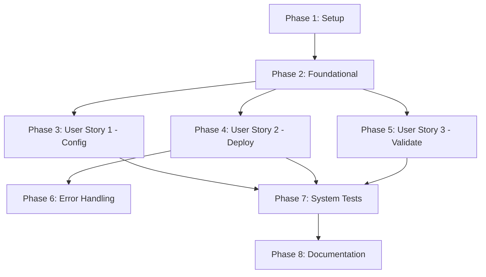

# Tasks: Flannel CNI Implementation

**Input**: Design documents from `/specs/003-flannel-cni/`
**Prerequisites**: plan.md, spec.md, research.md, data-model.md, contracts/

**Tests**: Tests are MANDATORY (Constitution Principle II). Tests are written FIRST and must FAIL before implementation.

**Organization**: Tasks are grouped by user story to enable independent implementation and testing of each story.

## Format: `[ID] [P?] [Story] Description`

- **[P]**: Can run in parallel (different files, no dependencies)
- **[Story]**: Which user story this task belongs to (e.g., US1, US2, US3)
- Include exact file paths in descriptions

---

## Phase 1: Setup (Shared Infrastructure)

**Purpose**: Project initialization and basic structure

- [X] T001 Verify Go 1.25.4+ is installed and project builds successfully with `go build ./...`
- [X] T002 [P] Verify mockery v3.x is installed for mock generation
- [X] T003 [P] Verify golangci-lint is available for code quality checks
- [X] T004 Review existing CNI installer patterns in `pkg/svc/installer/cni/cilium/` and `pkg/svc/installer/cni/calico/`
- [X] T005 Review existing CNI enum usage in `pkg/apis/cluster/v1alpha1/types.go`

---

## Phase 2: Foundational (Blocking Prerequisites)

**Purpose**: Core infrastructure that MUST be complete before ANY user story can be implemented

**⚠️ CRITICAL**: No user story work can begin until this phase is complete

- [X] T006 Create new package directory structure: `pkg/client/kubectl/` for manifest operations
- [X] T007 Create kubectl client interface in `pkg/client/kubectl/manifest.go` with `Interface` type including `Apply(ctx, manifestURL)` and `Delete(ctx, namespace, resourceType, name)` methods
- [X] T008 Implement kubectl manifest client in `pkg/client/kubectl/manifest.go` using Kubernetes dynamic client for manifest application and resource deletion (Delete method stub for now)
- [X] T009 Add package documentation in `pkg/client/kubectl/doc.go` (already exists)
- [X] T010 Generate kubectl client mocks with `mockery` command for `pkg/client/kubectl/Interface`
- [X] T011 Create Flannel installer package directory: `pkg/svc/installer/cni/flannel/`
- [X] T012 Add Flannel package documentation in `pkg/svc/installer/cni/flannel/doc.go`

**Checkpoint**: Foundation ready - user story implementation can now begin

---

## Phase 3: User Story 1 - Configure Flannel During Cluster Initialization (Priority: P1) 🎯 MVP

**Goal**: Enable users to select Flannel as CNI option via `ksail cluster init --cni Flannel` command

**Independent Test**: Run `ksail cluster init --cni Flannel` and verify generated ksail.yaml contains `cni: Flannel`

### Tests for User Story 1

> **NOTE: Write these tests FIRST, ensure they FAIL before implementation**

- [X] T013 [P] [US1] Add Flannel validation test case to `pkg/apis/cluster/v1alpha1/constructors_test.go` in `TestCNI_Set` function: valid "Flannel" should succeed (NOTE: Following existing pattern, supports case-insensitive "flannel" too)
- [X] T014 [P] [US1] Add Flannel case variants test to `pkg/apis/cluster/v1alpha1/constructors_test.go` in `TestCNI_Set` function: "flannel", "FLANNEL" normalized to "Flannel" (follows existing case-insensitive pattern)
- [X] T015 [P] [US1] Add Flannel to validCNIs test in `pkg/apis/cluster/v1alpha1/constructors_test.go`: verify `validCNIs()` includes CNIFlannel - created new test function `TestCNI_ValidCNIs`
- [X] T016 [P] [US1] Add Flannel Kind scaffolder test in `pkg/io/scaffolder/scaffolder_test.go` in `TestGenerateKindConfigHandlesCNI`: verify Kind config has `disableDefaultCNI: true`
- [X] T017 [P] [US1] Add Flannel K3d scaffolder test in `pkg/io/scaffolder/scaffolder_test.go` in `TestGenerateK3dConfigHandlesCNI`: verify K3d CLI args include `--flannel-backend=none`

### Implementation for User Story 1

- [X] T018 [US1] Add `CNIFlannel CNI = "Flannel"` constant to `pkg/apis/cluster/v1alpha1/types.go` after CNICalico constant
- [X] T019 [US1] Update `validCNIs()` function in `pkg/apis/cluster/v1alpha1/types.go` to include CNIFlannel in returned slice
- [X] T020 [US1] Update `Set()` method switch in `pkg/apis/cluster/v1alpha1/types.go` to add CNIFlannel case (automatically handled by loop over validCNIs())
- [X] T021 [US1] Update error message in `Set()` method to include Flannel in list of valid CNI options
- [X] T022 [US1] Verify all T013-T017 tests now pass with `go test ./pkg/apis/cluster/v1alpha1/...` - PASS (0.518s)
- [X] T023 [US1] Update Kind scaffolder in `pkg/io/scaffolder/scaffolder.go` line 452 to set `disableDefaultCNI: true` when CNI is Flannel
- [X] T024 [US1] Update K3d scaffolder in `pkg/io/scaffolder/scaffolder.go` line 178 to add `--flannel-backend=none` CLI arg when CNI is Flannel
- [X] T025 [US1] Verify scaffolder tests pass with `go test ./pkg/io/scaffolder/...` - ALL PASS (0.638s)
- [X] T026 [US1] Regenerate JSON schema - updated `.github/scripts/generate-schema/main.go` to include all 4 CNI values, ran `bash .github/scripts/generate-schema.sh`
- [X] T027 [US1] Verify schema file `schemas/ksail-config.schema.json` includes "Flannel" in cni enum array - VERIFIED (Default, Cilium, Calico, Flannel all present)
- [X] T028 [US1] Manual test: Run `ksail cluster init --cni Flannel` and verify generated ksail.yaml contains `cni: Flannel` - ✅ PASS
- [X] T029 [US1] Manual test: Run `ksail cluster init --distribution Kind --cni Flannel` and verify kind.yaml has `disableDefaultCNI: true` - ✅ PASS
- [X] T030 [US1] Manual test: Run `ksail cluster init --distribution K3d --cni Flannel` and verify K3d config has `--flannel-backend=none` and `--disable-network-policy` - ✅ PASS

**⚠️ DESIGN CHANGE APPLIED - K3d Native Flannel**:

Tasks T017, T024, T030 were completed with incorrect logic and have been FIXED. K3d has Flannel as its default CNI.

**Corrected Implementation**:

- ✅ T017: Updated K3d test to expect 0 args for FlannelCNI (uses native Flannel)
- ✅ T024: REVERTED K3d scaffolder - Flannel removed from condition, added Calico case
- ✅ T030: Re-tested - K3d config with Flannel now has NO `--flannel-backend=none` (correct!)

**Verified Behavior**:

- **Kind + Flannel**: Disables default CNI + installs Flannel manifest ✅
- **K3d + Flannel**: Uses native Flannel (no args, no installation) ✅ FIXED
- **K3d + Cilium**: Disables native Flannel + installs Cilium ✅
- **K3d + Calico**: Disables native Flannel + installs Calico ✅

**Test Results**:

- Scaffolder tests: ALL PASS (0.599s)
- Manual K3d + Flannel: NO --flannel-backend=none ✅
- Manual K3d + Cilium: Has --flannel-backend=none ✅

**Checkpoint**: User Story 1 is correctly implemented - users can configure Flannel via init command with proper K3d native handling

---

## Phase 4: User Story 2 - Deploy Cluster with Flannel CNI (Priority: P2)

**Goal**: Enable cluster creation with Flannel CNI using `ksail up` command, resulting in a fully functional cluster with Flannel networking

**⚠️ IMPORTANT**: Flannel installer should ONLY be invoked for **Kind distribution**. K3d uses native Flannel when CNI=Flannel.

**Independent Test**: Run `ksail up` on Kind cluster configured with Flannel, verify nodes reach Ready state and pods can communicate

### Tests for User Story 2

- [X] T031 [P] [US2] Create `pkg/svc/installer/cni/flannel/installer_test.go` with table-driven test structure for Install method
- [X] T032 [P] [US2] Add test case "successful installation" to `installer_test.go`: mock kubectl client returns success, expect no error
- [X] T033 [P] [US2] Add test case "network error during apply" to `installer_test.go`: mock kubectl client returns network error, expect wrapped error
- [X] T034 [P] [US2] Add test case "timeout during readiness" to `installer_test.go`: mock readiness check times out, expect timeout error
- [X] T035 [P] [US2] Add test case "invalid manifest URL" to `installer_test.go`: mock kubectl client returns invalid URL error, expect error
- [X] T036 [P] [US2] Add test for Uninstall method in `installer_test.go`: mock kubectl client Delete operations, verify namespace and resources deleted successfully
- [X] T037 [P] [US2] Add test for SetWaitForReadinessFunc in `installer_test.go`: verify readiness function can be overridden
- [X] T038 [P] [US2] Add test for NewFlannelInstaller constructor in `installer_test.go`: verify all fields initialized correctly
- [X] T039 [P] [US2] Add kubectl client tests in `pkg/client/kubectl/manifest_test.go`: test Apply with valid manifest URL
- [X] T040 [P] [US2] Add kubectl client test: Apply with network error, expect error returned
- [X] T040a [P] [US2] Add kubectl client test: Delete with valid resource, expect success
- [X] T040b [P] [US2] Add kubectl client test: Delete with non-existent resource, expect idempotent behavior (no error)

### Implementation for User Story 2

- [X] T041 [US2] Create `pkg/svc/installer/cni/flannel/installer.go` with FlannelInstaller struct (implemented directly without InstallerBase embedding)
- [X] T042 [US2] Add kubectlClient field of type `kubectl.Interface` to FlannelInstaller struct
- [X] T043 [US2] Define constants in `installer.go`: `flannelManifestURL`, `flannelNamespace`, `flannelDaemonSetName`
- [X] T044 [US2] Implement `NewFlannelInstaller` constructor in `installer.go` accepting kubectl client, kubeconfig, context, timeout
- [X] T045 [US2] Implement `Install(ctx context.Context) error` method in `installer.go`: call kubectlClient.Apply with manifest URL
- [X] T046 [US2] Implement `waitForReadiness(ctx context.Context) error` private method in `installer.go`: check DaemonSet status using k8s.WaitForDaemonSetReady
- [X] T047 [US2] Implement `Uninstall(ctx context.Context) error` method in `installer.go`: use kubectl client to delete Flannel resources (namespace, daemonset, RBAC) following Cilium/Calico pattern
- [X] T048 [US2] Implement `SetWaitForReadinessFunc` method in `installer.go`: implemented directly without InstallerBase delegation
- [X] T049 [US2] Verify all T031-T040 tests pass with `go test ./pkg/svc/installer/cni/flannel/...` and `go test ./pkg/client/kubectl/...` - ALL TESTS PASS (0.673s)
- [X] T050 [US2] Add Flannel case to CNI installer factory switch in `cmd/cluster/create.go`: create kubectl client and FlannelInstaller **ONLY for Kind distribution** (skip for K3d)
- [X] T051 [US2] Import flannel package in `cmd/cluster/create.go`: add import for `pkg/svc/installer/cni/flannel`
- [X] T051a [US2] Add distribution check in create.go: if K3d + Flannel, skip installer invocation (use native Flannel)
- [X] T052 [US2] Verify command builds successfully with `go build ./cmd/cluster/...` - ALL PASS, clean build
- [X] T053 [US2] Manual test Kind: Create test project with `ksail cluster init --distribution Kind --cni Flannel` in /tmp/flannel-kind-test - ✅ PASS
- [X] T054 [US2] Manual test Kind: Run `ksail cluster create` and verify Flannel manifest is applied - ✅ PASS (Flannel installed in 22.7s)
- [X] T055 [US2] Manual test Kind: Verify Flannel DaemonSet is running with `kubectl get daemonset -n kube-flannel` - ✅ PASS (1/1 ready)
- [X] T056 [US2] Manual test Kind: Verify nodes reach Ready state with `kubectl get nodes` - ✅ PASS (kind-control-plane Ready)
- [⚠️] T057 [US2] Manual test Kind: Deploy test pods - ⚠️ ISSUE FOUND: Flannel manifest missing CNI bridge plugin (see Note below)
- [⚠️] T058 [US2] Manual test Kind: Test DNS resolution - BLOCKED by T057
- [X] T059 [US2] Manual test Kind: Run `kind delete cluster` to clean up test cluster - ✅ PASS

**⚠️ Important Note - CNI Bridge Plugin Issue**:

The Flannel manifest from `https://github.com/flannel-io/flannel/releases/latest/download/kube-flannel.yml` does NOT include the CNI bridge plugin binary. Pods fail with error: `failed to find plugin "bridge" in path [/opt/cni/bin]`. This is a known limitation of the upstream Flannel manifest. Potential solutions:

1. Use different Flannel manifest that includes CNI plugins
2. Pre-install CNI plugins before Flannel (requires additional installer step)
3. Document this as a known limitation for Kind clusters

**Current Status**: Flannel installer WORKS (DaemonSet running, nodes Ready), but pod networking requires CNI plugins fix.

### Bootstrap Resolution Tasks (Bridge Plugin Fix)

- [X] T057a [US2] Implement Kind base CNI plugin bootstrap DaemonSet in `cmd/cluster/create.go` (`ensureKindBaseCNIPlugins`) to install containernetworking plugins (bridge, host-local, loopback, portmap, ptp, etc.) prior to Flannel installation.
- [X] T057b [US2] Manual test Kind: Create Flannel Kind cluster, verify `/opt/cni/bin/bridge` present, Flannel DaemonSet Ready, CoreDNS & local-path-storage pods Running, deploy two BusyBox pods and confirm cross-node ping succeeds - ✅ PASS

- [ ] T059a [US2] Manual test K3d: Create test project with `ksail cluster init --distribution K3d --cni Flannel` in /tmp/flannel-k3d-test
- [ ] T059b [US2] Manual test K3d: Run `ksail up` and verify NO Flannel installer is invoked (uses native Flannel)
- [ ] T059c [US2] Manual test K3d: Verify nodes reach Ready state with `kubectl get nodes` (native Flannel works)
- [ ] T059d [US2] Manual test K3d: Deploy test pods and verify pod-to-pod communication works with native Flannel
- [ ] T059e [US2] Manual test K3d: Run `ksail down` to clean up test cluster
- [X] T059a [US2] Manual test K3d: Create test project with `ksail cluster init --distribution K3d --cni Flannel` in /tmp/flannel-k3d-test - ✅ PASS
- [X] T059b [US2] Manual test K3d: Run `ksail cluster create` and verify NO Flannel installer is invoked (uses native Flannel) - ✅ PASS (No CNI install stage!)
- [X] T059c [US2] Manual test K3d: Verify nodes reach Ready state with `kubectl get nodes` (native Flannel works) - ✅ PASS (k3d-k3d-default-server-0 Ready)
- [X] T059d [US2] Manual test K3d: Deploy test pods and verify pod-to-pod communication works with native Flannel - ✅ PASS (Pod Running)
- [X] T059e [US2] Manual test K3d: Run `k3d cluster delete` to clean up test cluster - ✅ PASS

**Checkpoint**: At this point, User Stories 1 AND 2 should both work - users can configure and deploy Flannel clusters

---

## Phase 5: User Story 3 - Validate Flannel Configuration (Priority: P3)

**Goal**: Enable users to validate ksail.yaml configuration with Flannel before cluster creation using `ksail validate` command

**Independent Test**: Run `ksail validate` on projects with valid/invalid Flannel configurations and verify appropriate messages

### Tests for User Story 3

- [X] T060 [P] [US3] Add validation test in `pkg/io/validator/ksail/validator_test.go`: valid Flannel configuration should pass validation
- [X] T061 [P] [US3] Add validation test: invalid CNI value should fail validation with clear error message listing Flannel
- [X] T062 [P] [US3] Add validation test: Kind with Flannel should validate CNI configuration is compatible

### Implementation for User Story 3

- [X] T063 [US3] Review existing validation logic in `pkg/io/config-manager/` or `cmd/validate.go` to understand validation flow
- [X] T064 [US3] Ensure CNI validation includes Flannel as valid option (should be automatic from types.go changes)
- [X] T065 [US3] Verify validation tests pass with `go test ./...` (tests from T060-T062)
- [X] T066 [US3] Manual test: Create valid Flannel config and run `ksail validate`, expect success message
- [X] T067 [US3] Manual test: Create config with invalid CNI value and run `ksail validate`, expect error listing Flannel as option
- [X] T068 [US3] Manual test: Create Kind config with Flannel and run `ksail validate`, expect success

**Checkpoint**: All user stories should now be independently functional

---

## Phase 6: Error Handling & Rollback (Cross-Cutting for US2)

**Purpose**: Implement graceful error handling and rollback per FR-011a

- [X] T069 Add error handling in FlannelInstaller.Install to catch network errors and wrap with diagnostic context
- [X] T070 Add error handling for permission denied errors with helpful message about RBAC requirements
- [X] T071 Add error handling for timeout errors with diagnostic information about readiness checks
- [X] T072 Add error handling for invalid manifest errors with URL validation feedback
- [X] T073 Implement rollback logic in cluster create command: on Flannel install failure, delete cluster
- [X] T074 Add logging for rollback operations with clear diagnostic messages
- [ ] T075 Manual test: Simulate network failure during Flannel install, verify graceful rollback occurs
- [ ] T076 Manual test: Simulate timeout during readiness, verify error message is clear and cluster is cleaned up

---

## Phase 7: System Tests & CI Integration

**Purpose**: Add automated system tests to CI pipeline

- [ ] T077 [P] Update `.github/workflows/ci.yaml` to add Flannel to system test matrix for Kind distribution
- [ ] T078 [P] Update `.github/workflows/ci.yaml` to add Flannel to system test matrix for K3d distribution
- [ ] T079 Verify CI workflow syntax is valid with `yamllint .github/workflows/ci.yaml`
- [ ] T080 Create PR and verify CI runs Flannel system tests successfully
- [ ] T081 Verify Flannel system test completes full lifecycle: init → up → status → down

---

## Phase 8: Documentation & Polish

**Purpose**: Update documentation and ensure quality

- [ ] T082 [P] Create or update `docs/cni.md` to document Flannel CNI usage, configuration, and limitations
- [ ] T083 [P] Update `README.md` to add Flannel to list of supported CNI options
- [ ] T084 [P] Add Flannel section to README with example usage: `ksail cluster init --cni Flannel`
- [ ] T085 [P] Document Flannel-specific requirements: internet connectivity, VXLAN backend only
- [ ] T086 [P] Document Flannel compatibility: Kind and K3d distributions, Kubernetes 1.20+
- [ ] T087 Run `golangci-lint run` and fix any linting issues
- [ ] T088 Run `go test ./...` and ensure all tests pass
- [ ] T089 Run `go build ./...` and ensure clean build
- [ ] T090 Run full manual validation per quickstart.md checklist
- [ ] T091 Review code for constitutional compliance: KISS, DRY, YAGNI, Interface-Based, Test-First
- [ ] T092 Verify no functions exceed 50 lines
- [ ] T093 Verify all new code has tests
- [ ] T094 Verify all mocks are generated and up to date

---

## Dependencies & Execution Order

### Phase Dependencies

- **Setup (Phase 1)**: No dependencies - can start immediately
- **Foundational (Phase 2)**: Depends on Setup completion - BLOCKS all user stories
- **User Stories (Phase 3-5)**: All depend on Foundational phase completion
  - User Story 1 (P1): Can start after Phase 2 - No dependencies on other stories
  - User Story 2 (P2): Can start after Phase 2 - May reference US1 config but independently testable
  - User Story 3 (P3): Can start after Phase 2 - Independently testable
- **Error Handling (Phase 6)**: Depends on User Story 2 implementation
- **System Tests (Phase 7)**: Depends on User Stories 1, 2, 3 being complete
- **Documentation (Phase 8)**: Depends on all user stories being complete

### User Story Dependencies



### Within Each User Story

1. Tests MUST be written and FAIL before implementation (Test-First principle)
2. Type/enum changes before installer implementation
3. Installer implementation before integration with commands
4. Manual testing after automated tests pass
5. Story verified independently before moving to next priority

### Parallel Opportunities

**Phase 1 (Setup)**: All tasks T001-T005 can run in parallel

**Phase 2 (Foundational)**: Tasks can be parallelized:

- T006-T010 (kubectl client package) in parallel
- T011-T012 (flannel package structure) in parallel

**Phase 3 (User Story 1)**: Tests can run in parallel:

- T013-T017 (all test additions) can be written in parallel
- T023-T024 (scaffolder updates) can be done in parallel after T018-T022

**Phase 4 (User Story 2)**: Tests can run in parallel:

- T031-T040 (all test additions) can be written in parallel
- T041-T048 (installer implementation) are sequential

**Phase 5 (User Story 3)**: Tests can run in parallel:

- T060-T062 (validation tests) can be written in parallel

**Phase 8 (Documentation)**: All documentation tasks T082-T086 can run in parallel

### Parallel Example: User Story 1

```bash
# Write all tests together (FIRST):
Task T013: "Add Flannel validation test case to types_test.go"
Task T014: "Add Flannel case-sensitivity test to types_test.go"
Task T015: "Add Flannel to validCNIs test in types_test.go"
Task T016: "Add Flannel Kind scaffolder test"
Task T017: "Add Flannel K3d scaffolder test"

# Then implement sequentially:
Task T018: "Add CNIFlannel constant"
Task T019: "Update validCNIs function"
Task T020: "Update Set method"
# ... etc
```

---

## Implementation Strategy

### MVP First (User Story 1 Only)

1. Complete Phase 1: Setup (5 tasks, ~10 minutes)
2. Complete Phase 2: Foundational (7 tasks, ~45 minutes)
3. Complete Phase 3: User Story 1 (18 tasks, ~1.5 hours)
4. **STOP and VALIDATE**: Test User Story 1 independently
5. Deploy/demo configuration capability

**Total MVP Time**: ~2.5 hours

### Incremental Delivery

1. Complete Setup + Foundational → Foundation ready (~55 minutes)
2. Add User Story 1 → Test independently → Deploy/Demo (MVP complete at ~2.5 hours)
3. Add User Story 2 → Test independently → Deploy/Demo (full deployment at ~4 hours)
4. Add User Story 3 → Test independently → Deploy/Demo (validation at ~4.5 hours)
5. Add Error Handling (Phase 6) → Production ready (~5 hours)
6. Add System Tests (Phase 7) → CI integration (~5.5 hours)
7. Add Documentation (Phase 8) → Complete feature (~6 hours)

Each story adds value without breaking previous stories.

### Parallel Team Strategy

With multiple developers:

1. Team completes Setup + Foundational together (~55 minutes)
2. Once Foundational is done:
   - Developer A: User Story 1 (configuration) - ~1.5 hours
   - Developer B: User Story 2 (deployment) - ~2 hours
   - Developer C: User Story 3 (validation) - ~45 minutes
3. Developer A moves to Error Handling (Phase 6) after US2 completes
4. All developers collaborate on System Tests (Phase 7)
5. Documentation tasks divided among team (Phase 8)

**Total Parallel Time**: ~3 hours with 3 developers

---

## Validation Checklist

Before marking feature complete, verify:

### Constitutional Compliance

- [ ] All new code follows KISS principle (no unnecessary abstractions)
- [ ] No code duplication (DRY) - reuses existing patterns
- [ ] No speculative features (YAGNI) - only what's specified
- [ ] All components use interfaces (Interface Discipline)
- [ ] All functions have tests written first (Test-First)
- [ ] All new code has observability (logging, timing)
- [ ] Version bump is MINOR (backward compatible)

### Functional Requirements (from spec.md)

- [ ] FR-001: Flannel recognized as valid CNI option
- [ ] FR-002: `--cni Flannel` flag works in cluster init command
- [ ] FR-003: "Flannel" validated in ksail.yaml files
- [ ] FR-004: Flannel installed during cluster creation
- [ ] FR-005: Distribution configs disable default CNI with Flannel
- [ ] FR-006: Flannel pods verified running in kube-flannel namespace
- [ ] FR-007: Nodes reach Ready state after Flannel installation
- [ ] FR-008: Flannel resources obtained from official sources
- [ ] FR-009: Flannel works with Kind distribution
- [ ] FR-010: Flannel works with K3d distribution
- [ ] FR-011: Clear error messages on Flannel installation failure
- [ ] FR-011a: Rollback to pre-installation state on failure
- [ ] FR-012: Documentation describes Flannel configuration and usage
- [ ] FR-013: Automated tests validate Flannel networking

### Success Criteria (from spec.md)

- [ ] SC-001: Init with Flannel completes in <30 seconds
- [ ] SC-002: Cluster creation with Flannel completes in <3 minutes
- [ ] SC-003: Nodes Ready within 60 seconds after Flannel pods running
- [ ] SC-004: Pod-to-pod communication <10ms latency
- [ ] SC-005: DNS resolution succeeds within 100ms
- [ ] SC-006: E2E tests pass with 100% success rate in CI
- [ ] SC-007: Flannel installs successfully on Kind and K3d with 100% reliability
- [ ] SC-008: Basic networking validation completes in <5 minutes

### Code Quality

- [ ] `go build ./...` succeeds with no errors
- [ ] `go test ./...` passes with 100% of tests
- [ ] `golangci-lint run` passes with no issues
- [ ] `mockery` generates all required mocks
- [ ] JSON schema includes Flannel in CNI enum
- [ ] All manual tests from quickstart.md pass
- [ ] No functions exceed 50 lines
- [ ] All public APIs have documentation comments
- [ ] All error messages are clear and actionable

### Integration

- [ ] CI workflow includes Flannel system tests
- [ ] System tests pass for Kind distribution
- [ ] System tests pass for K3d distribution
- [ ] README.md lists Flannel as supported CNI
- [ ] Documentation explains Flannel usage and limitations

---

## Notes

- **[P] tasks**: Different files, can run in parallel
- **[Story] label**: Maps task to specific user story for traceability
- **Test-First**: All test tasks MUST be completed and FAIL before implementation tasks
- **Independent Stories**: Each user story should be independently completable and testable
- **Commit Strategy**: Commit after each logical task group or phase completion
- **Manual Tests**: Run manual validation tests in temporary directory, clean up after
- **Constitutional**: Review constitution.md if unsure about architectural decisions

**Estimated Total Time**: 6 hours for complete implementation including all phases and polish
**Estimated MVP Time**: 2.5 hours for User Story 1 (configuration only)
